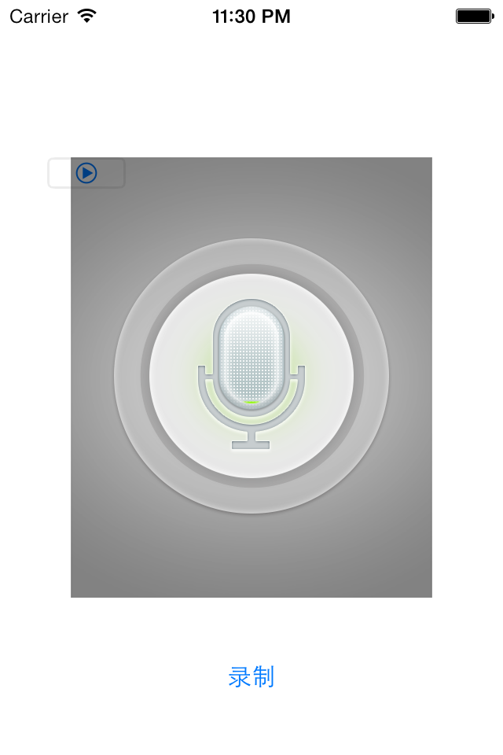
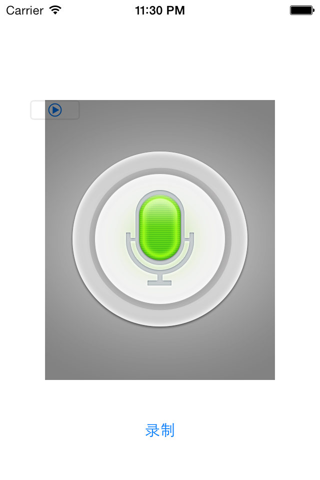

AudioRecorder
=============

###Preview

##Installation
1. copy folder `AudioRecorder` and `AudioSessionConfig` to your project.

##Usage
Just a few lines and it's very easy to use. Just refer to `viewDidLoad` for reference.
